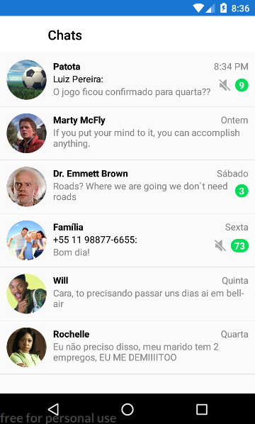
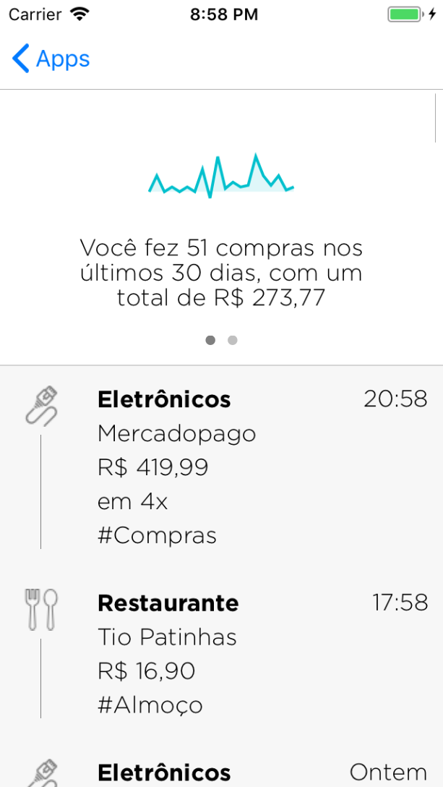
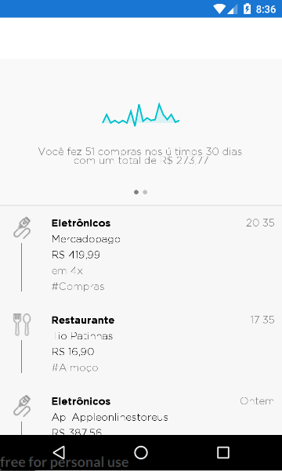

# Xamarin.Forms Interfaces

Este projeto foi criado para a palestra **Desenvolvendo interfaces "like a boss" com Xamarin.Forms**, que foi realizada no Xamarin Summit 2018, e tem como objetivo mostrar como telas profissionais e elegantes podem ser construídas utilizando Xamarin.Forms.

Slides da palestra em [https://speakerdeck.com/ionixjunior/desenvolvendo-interfaces-like-a-boss-com-xamarin-dot-forms?slide=1](https://speakerdeck.com/ionixjunior/desenvolvendo-interfaces-like-a-boss-com-xamarin-dot-forms?slide=1)

## Interfaces

Este projeto visa dar uma ideia de como as telas em questão podem ser desenvolvidas. As interfaces presentes aqui foram desenvolvidas para serem similares, não idênticas.

Foram desenvolvidos os seguintes layouts:

### WhatsApp Chat List

&nbsp;

### Nubank Timeline

&nbsp;

### Demais interfaces

No app ainda possuem WhatsApp Info e Netflix Home, mas estes ainda não foram finalizados.

